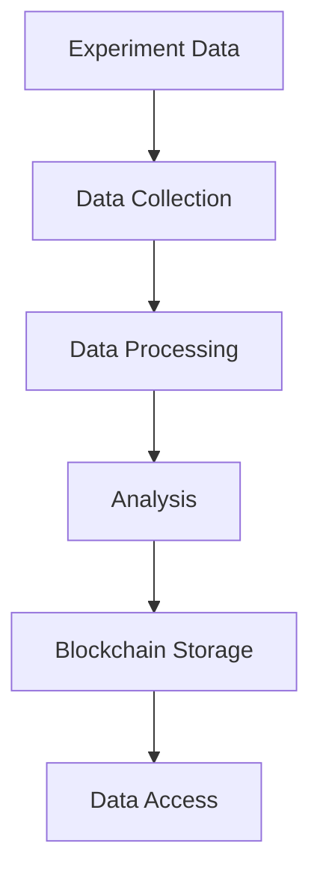

# MicroSpaceGen Architecture

## System Overview

MicroSpaceGen is built on a modern, scalable architecture that combines scientific computing, blockchain technology, and distributed systems. The platform is designed to be modular, extensible, and maintainable.

## Architecture Components

### 1. Core Components

#### 1.1 Experiment Management System
- **Purpose**: Manages space experiments and their lifecycle
- **Key Features**:
  - Experiment configuration and setup
  - Real-time data collection
  - Environmental parameter control
  - Experiment monitoring and control
- **Technologies**:
  - Python 3.8+
  - FastAPI for API endpoints
  - PostgreSQL for data storage
  - Redis for caching

#### 1.2 Gene Analysis Engine
- **Purpose**: Processes and analyzes genetic data
- **Key Features**:
  - DNA sequence analysis
  - Mutation detection
  - Phylogenetic analysis
  - Statistical analysis
- **Technologies**:
  - Biopython
  - NumPy
  - SciPy
  - scikit-learn

#### 1.3 Blockchain Integration
- **Purpose**: Ensures data integrity and transparency
- **Key Features**:
  - Immutable data storage
  - Smart contract automation
  - Proof of work consensus
  - Transparent data sharing
- **Technologies**:
  - Ethereum
  - Web3.py
  - Solidity
  - IPFS

### 2. Data Flow

### 3. System Architecture

#### 3.1 Frontend Layer
- Web-based user interface
- Real-time data visualization
- Interactive experiment control
- Mobile-responsive design

#### 3.2 Application Layer
- RESTful API endpoints
- WebSocket connections
- Authentication and authorization
- Rate limiting and caching

#### 3.3 Service Layer
- Microservices architecture
- Load balancing
- Service discovery
- Health monitoring

#### 3.4 Data Layer
- Distributed database
- Caching system
- File storage
- Backup system

### 4. Security Architecture

#### 4.1 Authentication
- JWT-based authentication
- OAuth2 integration
- Role-based access control
- Multi-factor authentication

#### 4.2 Data Security
- End-to-end encryption
- Data at rest encryption
- Secure key management
- Regular security audits

### 5. Deployment Architecture

#### 5.1 Containerization
- Docker containers
- Kubernetes orchestration
- Service mesh
- Auto-scaling

#### 5.2 Monitoring
- Prometheus metrics
- Grafana dashboards
- ELK stack logging
- Alert management

### 6. Integration Points

#### 6.1 External Systems
- NASA APIs
- SpaceX integration
- Research databases
- Scientific instruments

#### 6.2 Data Exchange
- Standardized data formats
- API versioning
- Rate limiting
- Error handling

## Technical Stack

### Backend
- Python 3.8+
- FastAPI
- PostgreSQL
- Redis
- Celery
- Web3.py

### Frontend
- React
- TypeScript
- Material-UI
- D3.js
- WebSocket

### Infrastructure
- Docker
- Kubernetes
- Terraform
- AWS/GCP
- CI/CD

### Monitoring
- Prometheus
- Grafana
- ELK Stack
- Sentry

## Scalability Considerations

### 1. Horizontal Scaling
- Microservices architecture
- Load balancing
- Database sharding
- Caching strategies

### 2. Performance Optimization
- Query optimization
- Caching layers
- Async processing
- Resource management

### 3. High Availability
- Redundancy
- Failover systems
- Backup strategies
- Disaster recovery

## Future Architecture Considerations

### 1. Planned Improvements
- AI/ML integration
- Edge computing
- Quantum computing readiness
- Cross-chain integration

### 2. Scalability Roadmap
- Multi-region deployment
- Global CDN
- Advanced caching
- Performance optimization

### 3. Technology Evolution
- Blockchain upgrades
- Database evolution
- API improvements
- Security enhancements 